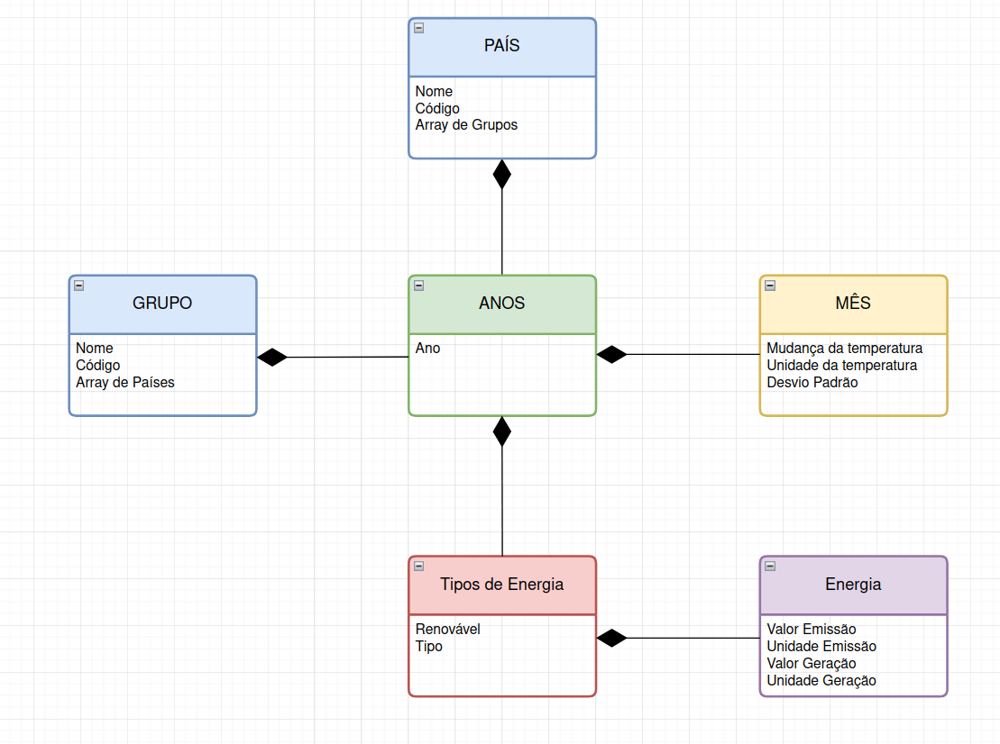

📁 Projeto MongoDB - MC536 (Unicamp)

## 👥 Integrantes (ID 1)

- Bruno Cardoso Holanda  – RA: 167542
- Rafael Campideli Hoyos – RA: 175100  
- Lucas Palacio Almeida  – RA: 236380

📌 Descrição do Projeto

Este repositório contém o Projeto 2 da disciplina de Banco de Dados (MC536), da Unicamp. O objetivo principal foi migrar um banco relacional existente para um banco de dados NoSQL, utilizando o MongoDB, aproveitando suas vantagens para dados semi-estruturados.
🧠 Justificativa da Escolha do MongoDB

A escolha do MongoDB como banco de dados NoSQL para este projeto se deu por conta das características específicas dos dados e dos requisitos do cenário em questão. A seguir, discutimos os principais aspectos técnicos que embasaram essa decisão:
🔹 Forma de Armazenamento

    O MongoDB utiliza documentos no formato BSON (uma extensão binária do JSON) para armazenar os dados.

    Isso permite flexibilidade estrutural, uma vez que diferentes documentos podem ter campos distintos, o que é ideal para cenários onde os dados não seguem um esquema rígido.

🔹 Linguagem e Processamento de Consultas

    As consultas em MongoDB são feitas utilizando uma linguagem baseada em JSON, o que facilita a leitura e escrita por desenvolvedores familiarizados com JavaScript e estruturas modernas de dados.

    O banco é otimizado para operações de leitura e escrita em documentos completos, sendo ideal para acesso rápido e eficiente a dados agregados.

🔹 Processamento e Controle de Transações

    O MongoDB suporta transações ACID desde a versão 4.0, porém seu foco principal ainda é em operações atômicas por documento.

    Isso se alinha com aplicações que não requerem o mesmo nível de consistência transacional de bancos relacionais, mas que ganham desempenho e escalabilidade.

🔹 Mecanismos de Recuperação

    O MongoDB oferece replicação automática por meio de réplicas (replica sets) e mecanismos de journaling, garantindo alta disponibilidade e recuperação rápida após falhas.

🔹 Segurança

    O banco oferece recursos como:

        Autenticação e autorização baseadas em roles

        Criptografia de dados em repouso e em trânsito

        Auditoria de operações

    Esses mecanismos atendem aos requisitos básicos de segurança em aplicações modernas.

📄 Modelo Lógico

Neste projeto, adotamos o modelo lógico orientado a documentos, conforme o padrão do MongoDB. Os dados foram reorganizados para refletir melhor as relações e hierarquias de forma aninhada.

### Modelo Lógico

🧱 Modelo Físico (Criação e População)

O script de criação  foi desenvolvido em Python, utilizando os mesmos dados do projeto anterior em banco relacional.

### Modelo Físico

[Modelo Físico](https://github.com/Palacio-dev/Projeto-MongoDB/tree/main/Modelos/Modelo_Fisico)

▶️ Script de População

    Inserir aqui os comandos insertMany() com os dados simulados ou convertidos do projeto relacional.

🔍 Consultas Avançadas

Foram desenvolvidas cinco consultas não triviais, explorando os recursos do MongoDB como agregações, operadores relacionais e filtros complexos.
Exemplo de Consultas

    Consulta de agregação com $group para contar registros agrupados por um campo.

    Uso de $lookup para simular joins entre coleções.

    Filtro com múltiplas condições ($and, $or, $gte, $in).

    Projeção personalizada com exclusão de campos.

    Ordenação e limitação de resultados com sort() e limit().

    Inserir aqui as consultas reais com seus respectivos resultados esperados.

📎 Instruções de Execução

    Certifique-se de ter o MongoDB instalado e em execução localmente ou em um servidor.

    Execute os scripts de criação e população utilizando o Mongo Shell ou outro cliente como MongoDB Compass ou mongosh.

    Teste as consultas descritas acima para verificar o funcionamento do banco.

📚 Referências

    Documentação oficial do MongoDB

    Material da disciplina MC536

